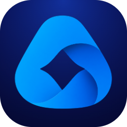
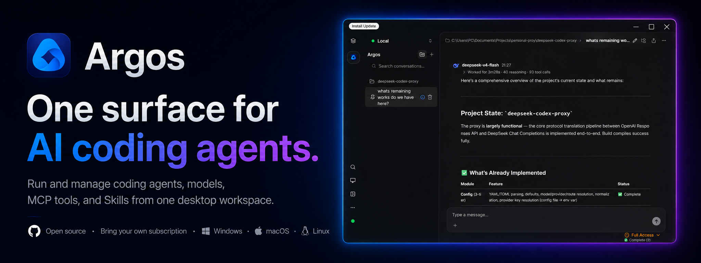
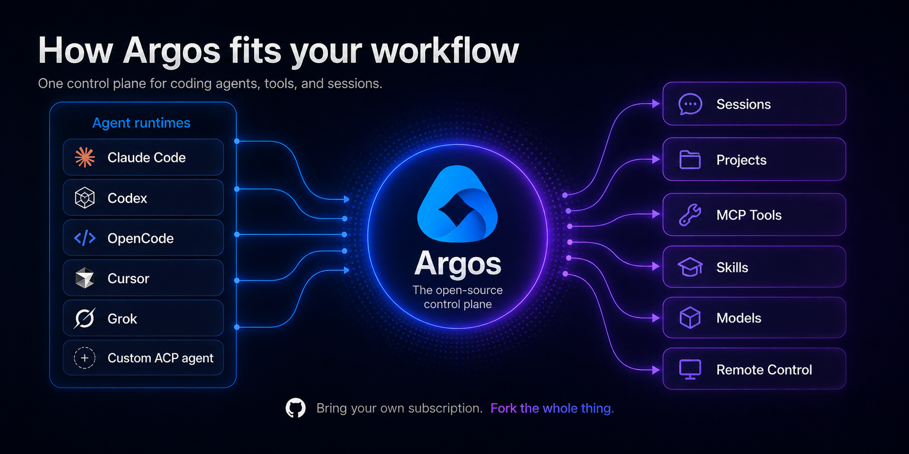
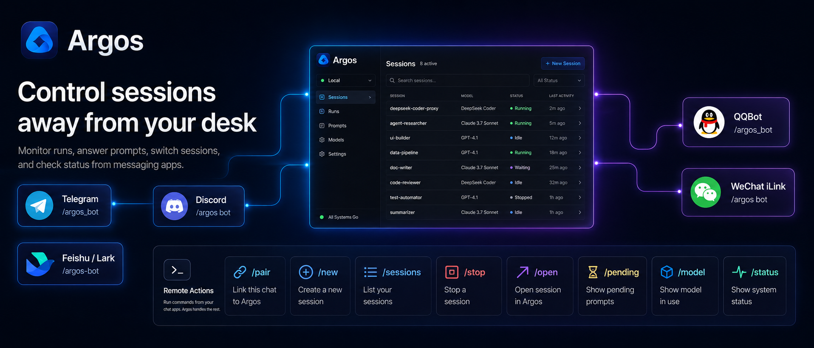

<p align='center'>

</p>

<h1 align="center">Argos</h1>

<p align="center"><strong>The open-source control plane for AI coding agents.</strong></p>

<p align="center">Run agents, models, MCP tools, and reusable Skills from one desktop workspace. Bring your own subscriptions and API keys. Keep your workflow. Own the stack.</p>

<p align="center">
  <a href="https://github.com/dvaJi/argos/releases">Download Argos</a> ·
  <a href="./docs/README.md">Documentation</a> ·
  <a href="./CONTRIBUTING.md">Contributing</a>
</p>

<p align="center">Windows · macOS · Linux · Apache-2.0</p>



## Table of Contents

- [One Workspace for Agentic Development](#one-workspace-for-agentic-development)
- [Control Sessions Away from Your Desk](#control-sessions-away-from-your-desk)
- [Skills Support](#skills-support)
- [ACP Integration (Agent Client Protocol)](#acp-integration-agent-client-protocol)
- [Supported Model Providers](#supported-model-providers)
- [Quick Start](#quick-start)
  - [Download and Install](#download-and-install)
  - [Configure Models](#configure-models)
  - [Start Conversations](#start-conversations)
- [Development Guide](#development-guide)
- [Community & Contribution](#community--contribution)
- [Acknowledgements](#acknowledgements)
- [License](#license)

## One Workspace for Agentic Development

Argos is a feature-rich open-source AI agent platform that brings together models, tools, and agent runtimes in one desktop control plane. Instead of rebuilding your workflow around one provider or one agent, Argos gives you one surface where the pieces can work together.



- **Agent runtimes & ACP** — Run ACP-compatible agents (built-in or custom commands) as first-class selectable "models" with a dedicated workspace UI.
- **MCP-native** — Full Resources/Prompts/Tools coverage, semantic workflows, inMemory services, StreamableHTTP/SSE/Stdio transports, visual debugging, and a bundled Bun interpreter.
- **Reusable Skills** — Install from folders, ZIPs, or URLs; enable per conversation; import/export with Claude Code, Codex, Cursor, Windsurf, GitHub Copilot, Kiro, Antigravity, OpenCode, Goose, Kilo Code, and more.
- **Any model** — 40+ first-class providers plus any OpenAI-, Gemini-, or Anthropic-compatible API, and integrated local Ollama with download, deploy, and run controls.
- **Rich chat** — Markdown + code rendering, multi-window/multi-tab parallelism, Artifacts, message retry and conversation forking, multi-modal (images, Mermaid, text-to-image), inline source highlighting.
- **Search extensions** — Built-in BoSearch and Brave Search MCP integrations, plus any custom search engine via a search-assistant model.
- **Remote control** — Drive Argos sessions from Telegram, Feishu/Lark, QQBot, Discord, and WeChat iLink.
- **Multi-platform & open source** — Windows, macOS, Linux with a themed light/dark UI, rich DeepLink support, encryption-ready data layer, and Apache 2.0 licensing for commercial use.

For more details, see the [documentation index](./docs/README.md).

## Control Sessions Away from Your Desk

Your coding session doesn't need to stop when you leave your computer. Through supported messaging channels you can inspect sessions, answer pending prompts, switch sessions, stop generation, change models, and check runtime status.



Configure remote channels under **Settings → Remote**. Remote endpoints can bind to a session, then create or switch sessions, stop generation, open the current session on desktop, answer pending questions or permission prompts, switch models, and check runtime status.

Supported channels: Telegram, Feishu/Lark, QQBot, Discord, and WeChat iLink.

Common commands: `/start`, `/help`, `/pair`, `/new`, `/sessions`, `/use`, `/stop`, `/open`, `/pending`, `/model`, `/status`.

## Skills Support

Argos Skills follow the standard Agent Skills specification: a Skill packages task instructions, reference files, assets, and optional scripts so Argos can act as a domain specialist once enabled.

Install from folders, ZIPs, or URLs, and import/export with Claude Code, Codex, Cursor, Windsurf, GitHub Copilot, Kiro, Antigravity, OpenCode, Goose, Kilo Code, and other compatible tools.

Built-in Skills cover generative art, code review, Argos settings, document collaboration, DOCX, frontend design, git commits, infographic syntax, MCP development, PDF, PPTX, Skill creation, Web Artifacts, and XLSX.

**Quick start:** **Settings → Skills** → install or import a Skill → enable it in conversations that need that capability.

## ACP Integration (Agent Client Protocol)

Argos has built-in support for [Agent Client Protocol (ACP)](https://agentclientprotocol.com), letting you integrate external agent runtimes with a native UI. Once enabled, ACP agents appear as first-class entries in the model selector.

**Quick start:** **Settings → ACP Agents** → enable ACP → enable a built-in agent or add a custom ACP-compatible command → select it in the model selector.

Browse the ecosystem: https://agentclientprotocol.com/overview/clients

## Supported Model Providers

Argos ships with 40+ first-class providers including DeepSeek, OpenAI (and OpenAI Responses), Moonshot/Kimi, Grok, Gemini, Anthropic, Ollama, AWS Bedrock, Azure OpenAI, Vertex AI, GitHub Models, GitHub Copilot, xAI, Zhipu, Doubao, DashScope, Groq, OpenRouter, Together, LM Studio, 302.AI, ModelScope, SiliconFlow, PPIO, JieKou.AI, ZenMux, Vercel AI Gateway, and Xiaomi MiMo. Any OpenAI-, Gemini-, or Anthropic-compatible endpoint is also supported.

For a full list with icons, see the in-app **Settings → Model Providers**.

## Quick Start

### Download and Install

**Option 1: GitHub Releases** — Grab the latest build for your system from [GitHub Releases](https://github.com/dvaJi/argos/releases): Windows `.exe`, macOS `.dmg`, or Linux `.AppImage` / `.deb`.

**Option 2: Official Website** — Download from [argos.aipurrjects.xyz](https://argos.aipurrjects.xyz/#/download).

**Option 3: Homebrew (macOS)**

```bash
brew install --cask argos
```

### Configure Models

1. Launch Argos
2. Open **Settings → Model Providers**
3. Add your API keys or configure local Ollama

### Start Conversations

1. Click **+** to create a new conversation
2. Pick a model from the selector
3. Start chatting

For a comprehensive guide, see the [documentation index](./docs/README.md).

## Development Guide

Read the [Contribution Guidelines](./CONTRIBUTING.md) first. Windows and Linux builds are produced by GitHub Actions; for macOS signing and packaging see the [Mac Release Guide](https://github.com/dvaJi/argos/wiki/Mac-Release-Guide).

### Install Dependencies

```bash
bun install
bun run installRuntime
# if you hit `No module named 'distutils'`:
pip install setuptools
```

> **Windows:** Enable Developer Mode (or run as Administrator) so `pnpm` can create symlinks and hardlinks.

### Start Development

```bash
bun run dev
```

### Build

```bash
bun run build:win        # Windows (current arch)
bun run build:mac        # macOS   (current arch)
bun run build:linux      # Linux   (current arch)
# Or target a specific architecture:
bun run build:win:x64    bun run build:win:arm64
bun run build:mac:x64    bun run build:mac:arm64
bun run build:linux:x64  bun run build:linux:arm64
```

See the [Developer Guide](./docs/developer-guide.md) for project structure and architecture.

## Community & Contribution

- [Report issues](https://github.com/dvaJi/argos/issues)
- [Submit feature suggestions](https://github.com/dvaJi/argos/issues)
- [Submit code improvements](https://github.com/dvaJi/argos/pulls)

See [CONTRIBUTING.md](./CONTRIBUTING.md) for the full guide.

## Acknowledgements

Argos is based on [DeepChat](https://github.com/ThinkInAIXYZ/deep-chat) by ThinkInAIXYZ, originally licensed under the Apache License 2.0. This project includes modifications and additional work by the Argos maintainers. See `LICENSE` and `NOTICE` for attribution and license details.

## License

[Apache License 2.0](./LICENSE)
