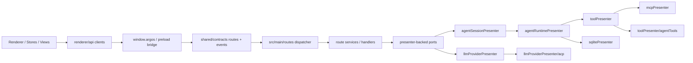

# Argos Current Architecture Overview

This document describes the main architecture as of `2026-07-27`. The current goal is not another full main-kernel rewrite, but rather to maintain the typed renderer-main boundary and wire new capabilities onto the existing route/runtime owners.

## Main Path

Key takeaways:

- Renderer business code flows through `renderer/api/*Client`, `window.argos`, and shared contracts.
- `src/main/routes/index.ts` is the typed route dispatcher and wires up routes for settings, sessions, chat, providers, models, config, MCP, plugins, skills, sync, browser, database security, scheduled tasks, and more.
- Presenters remain the runtime owners, but route services consume them only through narrow ports or explicit client dependencies.
- `SessionPresenter` is retained as a legacy data-access, export, and compatibility boundary; it is no longer the owner of the active chat main path.

## Module Responsibilities

| Module | Location | Responsibility |
| --- | --- | --- |
| `renderer/api` | `src/renderer/api/` | Typed renderer clients; absorbs bridge/channel details |
| shared contracts | `src/shared/contracts/` | Route registry, schemas, typed event catalog |
| preload bridge | `src/preload/createBridge.ts` / `src/preload/index.ts` | Exposes `window.argos.invoke/on` |
| main routes | `src/main/routes/` | Typed route dispatch, services, handlers |
| hot path ports | `src/main/routes/hotPathPorts.ts` / `src/main/presenter/runtimePorts.ts` | Minimal interface from route runtime to presenters |
| `AgentSessionPresenter` | `src/main/presenter/agentSessionPresenter/` | Session registry, window binding, legacy import, runtime delegation |
| `AgentRuntimePresenter` | `src/main/presenter/agentRuntimePresenter/` | Chat loop, streaming, tool interaction, message/session persistence |
| `ToolPresenter` | `src/main/presenter/toolPresenter/` | Aggregates MCP tools and local agent tools, permission pre-checks, call routing |
| `LLMProviderPresenter` | `src/main/presenter/llmProviderPresenter/` | Provider instances, model/runtime management, ACP helper, AI SDK runtime |
| `StartupWorkloadCoordinator` | `src/main/presenter/startupWorkloadCoordinator/` | Phased background task scheduling for startup/settings/floating targets |
| `RemoteControlPresenter` | `src/main/presenter/remoteControlPresenter/` | Telegram, QQBot, Discord, WeChat iLink remote control |
| `ScheduledTasksService` | `src/main/presenter/scheduledTasks/` | One-time, daily, and weekly task scheduling plus prompt/notify action dispatch |
| Spotlight search | `src/renderer/src/stores/ui/spotlight.ts` | Global search, session/message navigation, settings navigation, and non-destructive actions |
| Argos Server | `apps/daemon/` | Standalone/headless backend, authenticated routes/events, and served web UI |
| reusable UI | `packages/ui/` | React frontend loaded by Desktop from its managed daemon and served directly by Argos Server |
| client SDK | `packages/client-sdk/` | Authenticated WebSocket route/event transport used by Desktop and remote-machine validation |

## Current Layering

### 1. Renderer-Main Boundary

- `src/shared/contracts/routes*.ts` and `events*.ts` are the source of truth for contracts on the migrated path.
- `src/preload/createBridge.ts` unifies route invoke and typed event subscribe.
- `src/renderer/api/*Client.ts` is the default entry point for components and stores.
- `src/renderer/api/legacy/**` is the only legacy quarantine. It currently keeps three compatibility files: `presenters.ts`, `presenterTransport.ts`, and `runtime.ts`; new business modules should not import the legacy transport directly.

### 2. Main Route Runtime

- `src/main/routes/index.ts` dispatches requests based on the route registry.
- `SessionService`, `ChatService`, and `ProviderService` own the migrated chat/session/provider hot path.
- `ProviderImportService` scans and applies external provider configurations.
- The models routes provide the model catalog, runtime list, config import/export, and audio transcription.
- Database security and scheduled tasks are already typed routes; the renderer calls them through dedicated clients.

### 3. Agent Runtime

- `AgentSessionPresenter` creates, restores, and activates sessions, then delegates execution to `AgentRuntimePresenter`.
- `AgentRuntimePresenter` owns the stream loop, tool loop, pending input, manual/auto compaction, message trace, and structured message persistence.
- `ArgosMessageStore` follows a header table + structured sub-tables model and falls back to legacy JSON on the read path when rows are missing.
- History search uses `argos_search_documents` with FTS5, falling back to `LIKE` when FTS is unavailable.
- Agent progress uses `agent-core/update_plan`, `chat.plan.updated`, and a renderer overlay to surface the task plan.

### 4. Provider And Media Runtime

- `ModelType` currently covers chat, embedding, rerank, imageGeneration, videoGeneration, and tts.
- OpenAI-compatible image/video generation and TTS cooperate via model config, provider route meta, the AI SDK runtime, and message rendering.
- Local audio transcription flows through `ModelClient.transcribeAudio()` / `models.transcribeAudio`, handled by the provider runtime.
- Both provider deeplinks and provider config imports perform preview, validation, conflict handling, and desensitized display before writing.

### 5. Compatibility Boundary

Still retained but only serving compatibility duties:

- `src/main/presenter/agentSessionPresenter/legacyImportService.ts`
- The old `conversations/messages` data domain, as an import-only source and export data source
- `src/main/presenter/sessionPresenter/`, as an in-main compatibility/data facade
- `src/main/eventbus.ts`, which continues to serve unmigrated paths; migrated UI notifications prefer typed events

### 6. Desktop, Server, and Remote Machines

Argos Desktop is an Electron shell, not a second backend implementation. It
starts a private local `argos-daemon`, loads `@argos/ui` from that daemon, and
uses the hybrid preload bridge:

- native-only routes such as secure credential storage stay in Electron IPC;
- local and remote backend routes use the typed client SDK over WebSocket;
- a standalone Argos Server is the same daemon runtime without Desktop-owned
  native capabilities.

Remote machines are keyed by a persistent environment ID, not by URL. Pairing
exchanges a short-lived single-use token for a revocable bearer session. The
bearer is encrypted through Electron `safeStorage`; renderer state and machine
configuration retain only an opaque credential reference. Before saving or
updating an address, Desktop verifies authenticated route transport, event
welcome/readiness, protocol compatibility, capabilities, and environment
identity.

Standalone Server executables embed Bun, the daemon code, DuckDB's target
native binding, and its companion shared library. The shared library is
materialized into a versioned runtime cache when the executable starts; users
still download and launch one Server executable with no separate Bun, Node.js,
or DuckDB installation.

## Anti-Regression Rules

- New renderer-main capabilities go through `renderer/api/*Client` + `window.argos` + shared contracts by default.
- The legacy transport must stay inside `src/renderer/api/legacy/**`; no second quarantine directory is added.
- `scripts/architecture-guard.mjs` pins the quarantine file count, detects direct legacy transport usage, and reads `docs/architecture/baselines/main-kernel-bridge-register.json`.
- `scripts/agent-cleanup-guard.mjs` prevents retired agent runtime entry points from creeping back in.

## Recommended Reading Order

1. [README.md](./README.md)
2. [guides/code-navigation.md](./guides/code-navigation.md)
3. [FLOWS.md](./FLOWS.md)
4. [architecture/agent-system.md](./architecture/agent-system.md)
5. [architecture/tool-system.md](./architecture/tool-system.md)
6. [architecture/session-management.md](./architecture/session-management.md)
