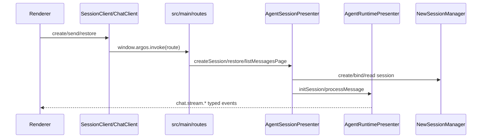
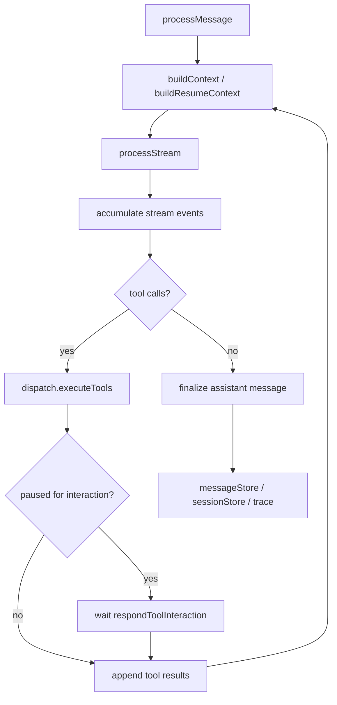
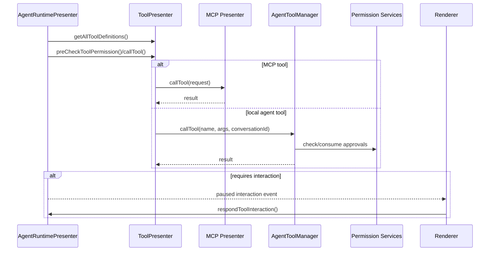
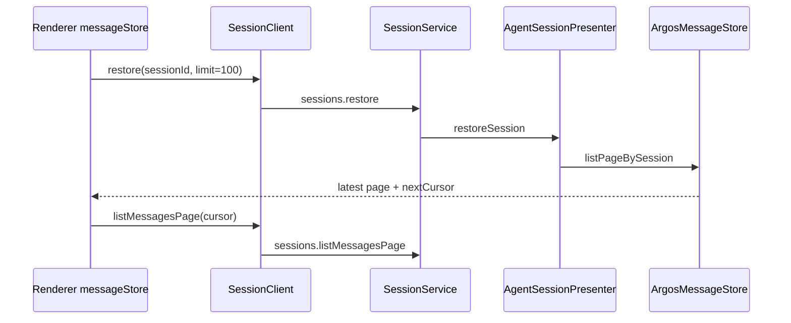
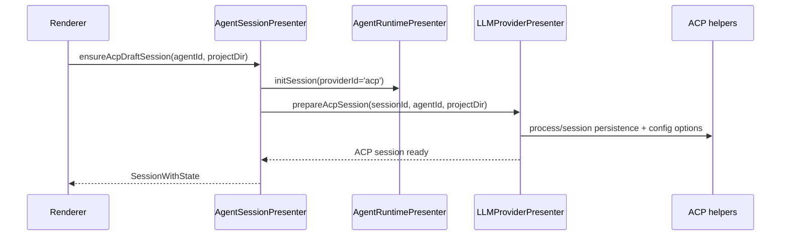
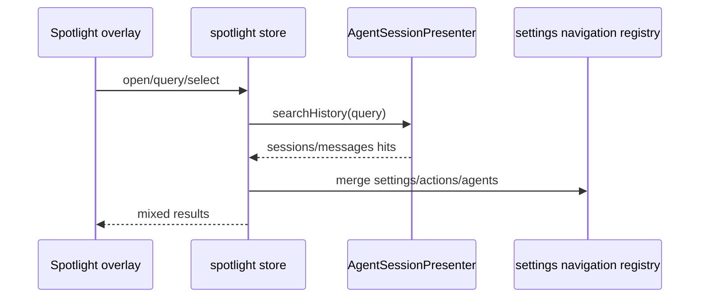
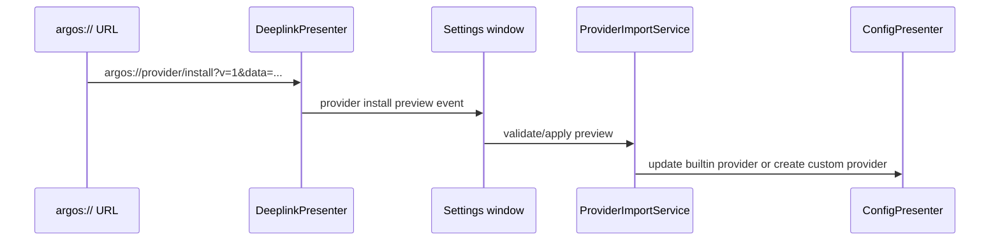
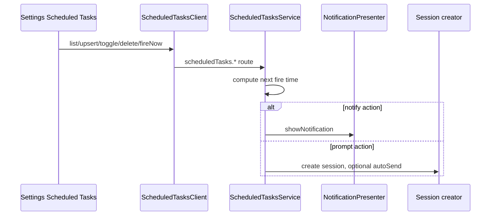
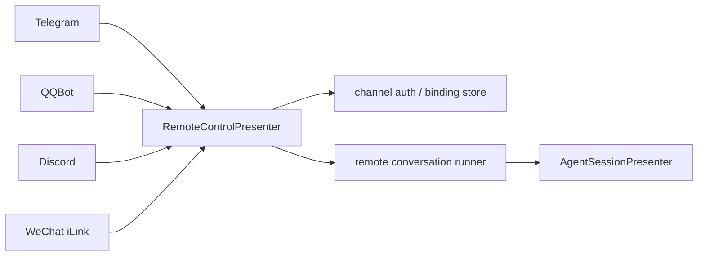

# Argos Current Core Flows

This document describes only flows still used by the current code. Historical flows such as `AgentPresenter` / `startStreamCompletion` are no longer kept as long-term in-repo documentation; use `git log` / `git show` to trace historical commits when needed.

## 1. Create a Session and Send a Message



Key files:

- `src/renderer/api/SessionClient.ts`
- `src/renderer/api/ChatClient.ts`
- `src/main/routes/sessions/sessionService.ts`
- `src/main/routes/chat/chatService.ts`
- `src/main/presenter/agentSessionPresenter/index.ts`
- `src/main/presenter/agentRuntimePresenter/index.ts`

## 2. Argos Message Processing Main Loop



Key semantics:

- `generationSettings` is passed uniformly across session creation, drafts, and the active session, covering runtime settings such as system prompt, temperature, topP, max tokens, reasoning effort, and verbosity.
- `sessions.compact` triggers manual context compaction; automatic compaction settings are stored in the agent/session configuration.
- Message traces are persisted independently; the renderer queries them via `sessions.listMessageTraces`.
- Failed messages retain resume context; the tool output guard limits oversized tool output from entering subsequent context.
- The `agent-core/update_plan` tool only updates plan state and the `chat.plan.updated` event; it does not expose the internal tool call as an ordinary message block.

## 3. Tool Calls, Permissions, and Subagents



Current local agent tools include file system, command execution, chat settings, and subagent orchestration. Subagent sessions are stored with `sessionKind='subagent'`; the parent session processes child session results via tape merge/discard.

## 4. Session Restore, Pagination, and Search



Structured persistence current model:

- `argos_messages` stores message headers and a stable JSON fallback.
- `argos_user_messages`, `argos_user_message_files`, and `argos_user_message_links` store hot fields for user messages.
- `argos_assistant_blocks` stores assistant block deltas.
- `argos_search_documents` / `_fts` store the historical search index.

## 5. ACP Session / Runtime Preparation



ACP configuration options go through `sessions.getAcpSessionConfigOptions` / `sessions.setAcpSessionConfigOption`. When remote control creates an ACP session, it uses the channel's `defaultWorkdir` or the global default project path, and rejects ACP default agents that have no workdir.

## 6. Spotlight Search



Spotlight opens by default via `CommandOrControl+P` and mixes recent sessions, agents, settings, actions, and historical messages. A message hit writes a pending jump; `ChatPage` scrolls to and highlights the target message after it finishes loading.

## 7. Provider Import And Deeplinks



Currently supported:

- `argos://start`
- `argos://mcp/install`
- `argos://provider/install`
- provider config import scan/apply, including sources such as Codex, Claude Code, Cherry Studio, and CC Switch
- model config import/export, plus credential-only import for built-in/custom providers

## 8. Scheduled Tasks



Triggers support once, daily, and weekly; actions support notification and prompt. A prompt action can specify agent, provider, model, and system prompt, and creates a session via the route runtime.

## 9. Remote Control



Unified remote control supports binding, default agent, default workdir, `/sessions`, `/model`, status output, media/Markdown rendering, and tool interaction prompts. Protocol differences per channel live in `remoteControlPresenter/<channel>/` and `remoteControlPresenter/services/*CommandRouter.ts`.

## 10. Pair and Use a Remote Machine

```mermaid
sequenceDiagram
    participant User
    participant Desktop as Argos Desktop
    participant Main as Electron main / safeStorage
    participant SDK as client SDK
    participant Server as Argos Server

    User->>Server: start --host ... --pair
    Server-->>User: one-time pairing link + ARGOS1 code
    User->>Desktop: paste link/code
    Desktop->>Main: pairRemote(entry)
    Main->>Server: exchange one-time token
    Server-->>Main: session id + bearer
    Main->>Server: authenticated environment handshake
    Main->>Main: encrypt bearer; retain opaque reference
    Main-->>Desktop: verified non-secret metadata
    Desktop->>SDK: connect with resolved bearer
    SDK->>Server: authenticated WebSocket + event welcome
    Server-->>Desktop: routes and events for selected machine
```

Important invariants:

- `/health` proves reachability only and never marks a machine verified.
- Pairing links and `ARGOS1 <S|P> <host[:port]> <token>` codes carry the same
  short-lived single-use token.
- The renderer never receives the bearer session; Electron resolves it only
  when creating the authenticated transport.
- Reconnect after Desktop or daemon restart reuses the encrypted session and
  persistent environment identity.
- Editing an address verifies the same environment identity before persistence.
- A different environment at a known address fails closed and requires pairing.
- Revocation invalidates HTTP requests immediately and closes an active
  WebSocket when it next sends a message.
- A failed remote action never falls back to This computer.

The machine selector exposes connected/connecting/disconnected text, Pair
again, identity-checked address editing, redacted diagnostics, and local
forget/remote revoke outcomes. Remote Control integrations remain a separate
feature and runtime flow.
