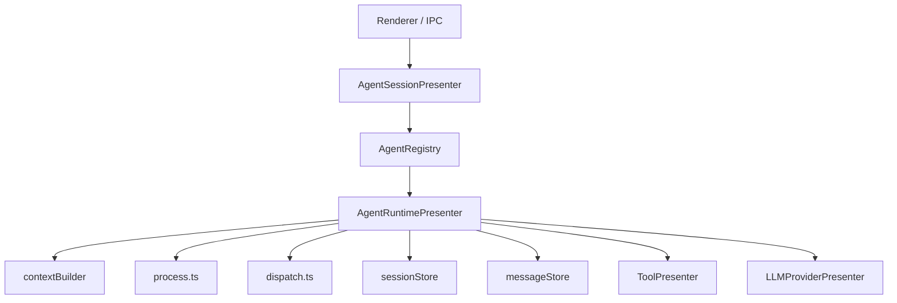

# Agent System Architecture

This document describes the agent system that remains in effect after the retirement. The old `AgentPresenter` details are no longer kept as long-term documentation in the repository; consult `git log` / `git show` when you need to compare against history.

## Current Runtime Ownership



Core principles:

- The renderer talks only to `agentSessionPresenter`
- `agentSessionPresenter` only performs session orchestration; it does not run the chat loop
- `agentRuntimePresenter` exclusively owns the chat runtime

## Module Layout

### `agentSessionPresenter/`

```text
agentSessionPresenter/
├── index.ts
├── agentRegistry.ts
├── sessionManager.ts
├── messageManager.ts
└── legacyImportService.ts
```

Responsibilities:

- Register and resolve agent implementations
- Create, delete, activate, and fork sessions
- Bind windows to sessions
- Expose renderer IPC methods
- Retain the legacy import flow

### `agentRuntimePresenter/`

```text
agentRuntimePresenter/
├── index.ts
├── process.ts
├── dispatch.ts
├── contextBuilder.ts
├── sessionStore.ts
├── messageStore.ts
├── pendingInputStore.ts
├── pendingInputCoordinator.ts
├── compactionService.ts
├── echo.ts
└── toolOutputGuard.ts
```

Responsibilities:

- Initialize session runtime state
- Handle `processMessage()` / `respondToolInteraction()`
- Run the stream loop and the tool loop
- Persist messages and runtime state
- Perform context compaction, tool output guard, and real-time echo

## Responsibility Split

| Layer | Main file | Responsibility |
| --- | --- | --- |
| Session orchestration | `src/main/presenter/agentSessionPresenter/index.ts` | Session lifecycle and IPC |
| Agent runtime | `src/main/presenter/agentRuntimePresenter/index.ts` | Run state, cancellation, resumption, model/permission switching |
| Stream loop | `src/main/presenter/agentRuntimePresenter/process.ts` | Call the provider, accumulate blocks, drive the tool loop |
| Tool dispatch | `src/main/presenter/agentRuntimePresenter/dispatch.ts` | Call `ToolPresenter`, pause for interaction, produce tool results |
| Context build | `src/main/presenter/agentRuntimePresenter/contextBuilder.ts` | History trimming, resume context, token budget |
| Persistence | `src/main/presenter/agentRuntimePresenter/messageStore.ts` | Message persistence, paginated reads, structured content reconstruction, and fault recovery |
| Compaction | `src/main/presenter/agentRuntimePresenter/compactionService.ts` | Manual/auto context compaction and compaction status messages |
| Pending input | `src/main/presenter/agentRuntimePresenter/pendingInputStore.ts` | Queued input, steer, reordering, and recovery |

## Persistence Hot Path

`ArgosMessageStore` now follows a "header table + structured sub-tables" main-path model:

- `argos_messages` as the message header table
- `argos_user_messages` / `files` / `links` store user hot fields
- `argos_assistant_blocks` stores assistant blocks
- `argos_search_documents` / `_fts` store the history search index

Key semantics:

- During streaming, only `argos_assistant_blocks` is updated incrementally
- The stable `argos_messages.content` is written back only when the message reaches `sent/error`
- The read path reconstructs `ChatMessageRecord.content` from the structured tables first, falling back to the legacy JSON when rows are missing
- `sessions.restore` only restores the most recent page of messages by default; older history is paged in via `sessions.listMessagesPage`
- `argos_search_documents` / `_fts` provide the history search index, falling back to `LIKE` when FTS is unavailable

## Runtime Capabilities

- Session generation settings are persisted on session creation and update, covering system prompt, temperature, topP, max tokens, reasoning effort, verbosity, and other settings.
- Message traces are persisted independently, so they can be inspected from the message toolbar at runtime.
- Subagent sessions enter the same session/message store with `sessionKind='subagent'`; parent sessions absorb or discard child results via tape merge/discard.
- Local audio transcription, TTS, image generation, and video generation all reuse the provider/model capability checks and no longer bypass the provider runtime.

## Compatibility Boundary

After this round of retirement, the following are retained but are not part of the active runtime:

- `LegacyChatImportService`
- Legacy import hook / status
- Old `conversations/messages` tables
- `SessionPresenter` exports, thread list, and legacy data query capabilities

The following capabilities have been retired from the live code:

- `AgentPresenter` runtime main entry
- `startStreamCompletion()` legacy streaming interface
- Renderer entry points exposed via `presenter.agentPresenter` / `presenter.sessionPresenter`

## Debugging Entry Points

To trace the lifecycle of a real message, the recommended order is:

1. `src/main/presenter/agentSessionPresenter/index.ts`
2. `src/main/presenter/agentRuntimePresenter/index.ts`
3. `src/main/presenter/agentRuntimePresenter/process.ts`
4. `src/main/presenter/agentRuntimePresenter/dispatch.ts`
5. `src/main/presenter/toolPresenter/index.ts`

## Historical Notes

If you find old design docs, old PRs, or old specs that still mention any of the concepts below, they have all been retired:

- `AgentPresenter`
- `agentLoopHandler`
- `streamGenerationHandler`
- `permissionHandler`
- `startStreamCompletion`

When you need to compare against the old implementation, view the historical source snapshots from past commits; do not treat the deleted historical design as an active navigation entry point.
