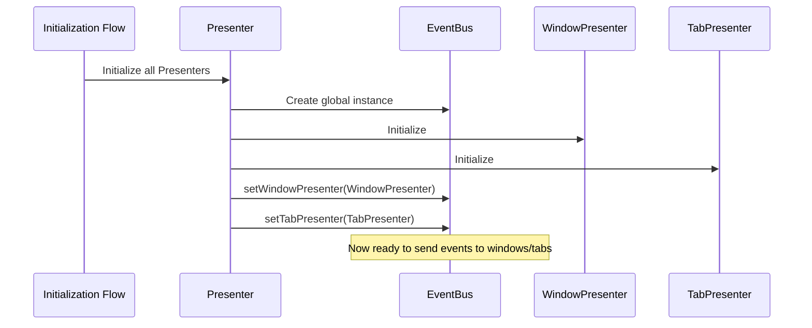
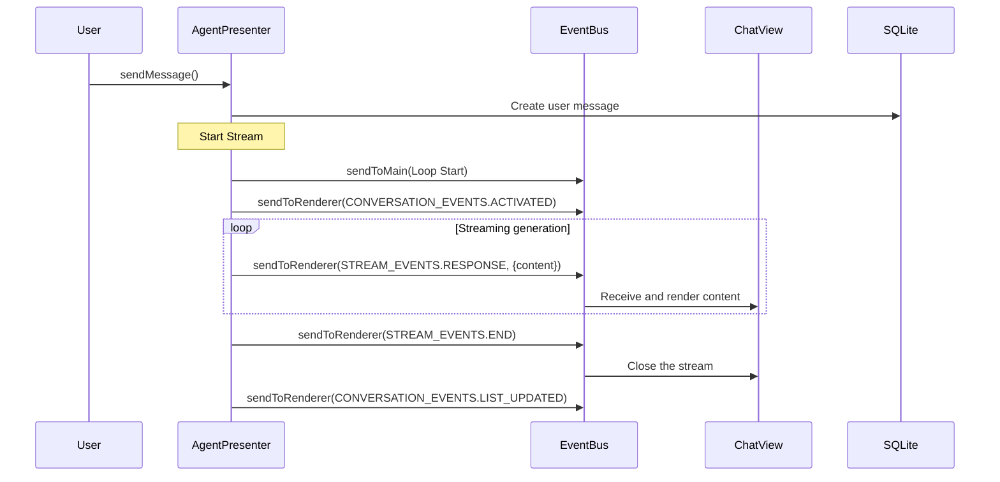
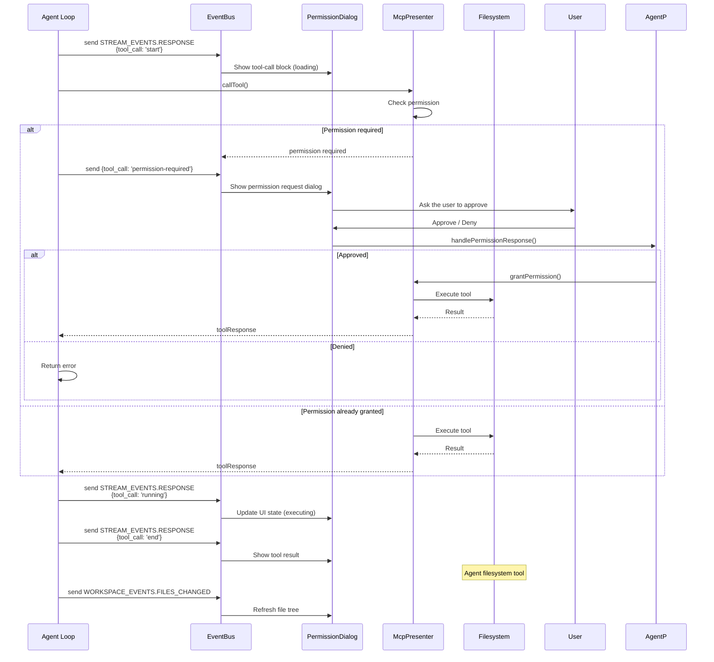
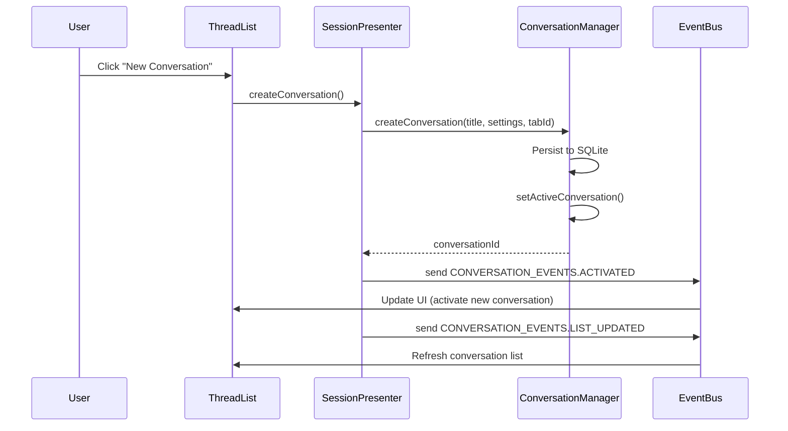
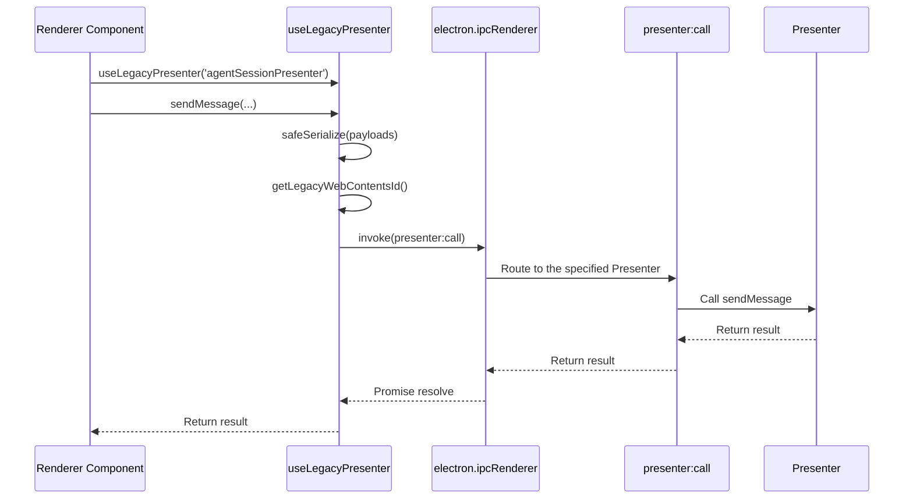

# Event System In Depth

This document details the Argos event system architecture, including the EventBus, event constant definitions, and communication patterns.

Notes:

- The active renderer-main boundary now prefers `renderer/api/*Client` + `window.argos` + typed contracts.
- References below to `useLegacyPresenter()`, `window.api`, and raw `window.electron` should be treated as legacy / compatibility background.
- For the current single-track rules, see the renderer-main boundary section of `docs/ARCHITECTURE.md`.

## 📋 Core Components

| Component | File | Responsibility |
|-----------|------|----------------|
| **EventBus** | `src/main/eventbus.ts` | Unified event emission and reception |
| **events.ts** | `src/main/events.ts` | Event constant definitions |

## 🏗️ EventBus Architecture

### Class Structure

```typescript
export class EventBus extends EventEmitter {
  private windowPresenter: IWindowPresenter | null = null
  private tabPresenter: ITabPresenter | null = null

  // Main-process internal only
  sendToMain(eventName: string, ...args: unknown[])

  // Send to renderer processes
  sendToRenderer(eventName: string, target: SendTarget, ...args: unknown[])

  // Send to a specific window
  sendToWindow(eventName: string, windowId: number, ...args: unknown[])

  // Send to a specific tab
  sendToTab(tabId: number, eventName: string, ...args: unknown[])

  // Send to the active tab of a window
  sendToActiveTab(windowId: number, eventName: string, ...args: unknown[])

  // Send to both the main process and renderer processes
  send(eventName: string, target: SendTarget, ...args: unknown[])

  // Set the window/tab presenters
  setWindowPresenter(windowPresenter: IWindowPresenter)
  setTabPresenter(tabPresenter: ITabPresenter)
}
```

**File location:** `src/main/eventbus.ts:9-148`

### SendTarget Enum

```typescript
export enum SendTarget {
  ALL_WINDOWS = 'all_windows',    // Renderer process of all windows
  DEFAULT_TAB = 'default_tab'    // Default tab
}
```

### Initialization Flow



**File location:** `src/main/presenter/index.ts` (initialization order)

## 📡 Communication Patterns

### 1. sendToMain — Intra-Main-Process Communication

```typescript
// Emit an event within the main process
eventBus.sendToMain('some:event', payload)

// Listen within the main process
eventBus.on('some:event', (payload) => {
  console.log('Received event:', payload)
})
```

**Use cases:**
- Calls between Presenters
- Intra-main-process state notifications
- Communication that does not involve the renderer

### 2. sendToRenderer — Main → Renderer Communication

```typescript
// Send to renderer processes of all windows
eventBus.sendToRenderer(
  STREAM_EVENTS.RESPONSE,
  SendTarget.ALL_WINDOWS,
  { eventId: 'msg123', content: 'Hello' }
)

// Send to the default tab
eventBus.sendToRenderer(
  STREAM_EVENTS.END,
  SendTarget.DEFAULT_TAB,
  { eventId: 'msg123' }
)
```

**Implementation:**

```typescript
sendToRenderer(eventName: string, target: SendTarget, ...args) {
  if (!this.windowPresenter) {
    console.warn('WindowPresenter is not available')
    return
  }

  switch (target) {
    case SendTarget.ALL_WINDOWS:
      // Send to all windows
      this.windowPresenter.sendToAllWindows(eventName, ...args)
      break

    case SendTarget.DEFAULT_TAB:
      // Send to the default tab
      this.windowPresenter.sendToDefaultTab(eventName, true, ...args)
      break

    default:
      this.windowPresenter.sendToAllWindows(eventName, ...args)
  }
}
```

**File location:** `src/main/eventbus.ts:36-56`

### 3. sendToTab — Targeted Tab Communication

```typescript
// Send to a specific tab
eventBus.sendToTab(tabId, CONVERSATION_EVENTS.SCROLL_TO_MESSAGE, {
  conversationId,
  messageId
})
```

**Implementation:**

```typescript
sendToTab(tabId: number, eventName: string, ...args) {
  if (!this.tabPresenter) {
    console.warn('TabPresenter is not available')
    return
  }

  // Get the Tab instance and send the event
  this.tabPresenter.getTab(tabId).then(tabView => {
    if (tabView && !tabView.webContents.isDestroyed()) {
      tabView.webContents.send(eventName, ...args)
    } else {
      console.warn(`Tab ${tabId} does not exist or has been destroyed`)
    }
  }).catch(error => {
    console.error(`Failed to send event ${eventName} to Tab ${tabId}:`, error)
  })
}
```

**File location:** `src/main/eventbus.ts:92-110`

### 4. sendToWindow — Window-Level Communication

```typescript
// Send to all tabs of a specific window
eventBus.sendToWindow(windowId, TAB_EVENTS.TITLE_UPDATED, {
  title: 'New Title'
})
```

**Implementation:**

```typescript
sendToWindow(eventName: string, windowId: number, ...args) {
  if (!this.windowPresenter) {
    console.warn('WindowPresenter is not available')
    return
  }

  this.windowPresenter.sendToWindow(windowId, eventName, ...args)
}
```

**File location:** `src/main/eventbus.ts:23-28`

### 5. sendToActiveTab — Window Active Tab Communication

```typescript
// Send to the active tab of a window
eventBus.sendToActiveTab(windowId, CONVERSATION_EVENTS.ACTIVATED, {
  conversationId
})
```

**Implementation:**

```typescript
sendToActiveTab(windowId: number, eventName: string, ...args) {
  if (!this.tabPresenter) {
    console.warn('TabPresenter is not available')
    return
  }

  this.tabPresenter.getActiveTabId(windowId).then(activeTabId => {
    if (activeTabId) {
      this.sendToTab(activeTabId, eventName, ...args)
    } else {
      console.warn(`Window ${windowId} has no active tab`)
    }
  })
}
```

**File location:** `src/main/eventbus.ts:119-137`

### 6. send — Send to Both Main and Renderer Processes

```typescript
// Trigger both an intra-main-process event and a renderer event simultaneously
eventBus.send(CONVERSATION_EVENTS.LIST_UPDATED, SendTarget.ALL_WINDOWS, {})
```

**Implementation:**

```typescript
send(eventName: string, target: SendTarget, ...args) {
  // Send within the main process
  this.sendToMain(eventName, ...args)

  // Send to renderer processes
  this.sendToRenderer(eventName, target, ...args)
}
```

**File location:** `src/main/eventbus.ts:64-69`

## 📋 Event Constant Definitions

### STREAM_EVENTS — Stream Generation Events

```typescript
export const STREAM_EVENTS = {
  RESPONSE: 'stream:response',      // Streamed response content
  END: 'stream:end',                 // Stream end event
  ERROR: 'stream:error'             // Stream error event
}
```

**Use cases:**
- **RESPONSE**: LLM streamed content, tool-call events, and usage info
- **END**: Stream generation completed (whether successful or stopped by the user)
- **ERROR**: LLM error or generation failure

**File location:** `src/main/events.ts:67-71`

**Example:**

```typescript
// Send text content
eventBus.sendToRenderer(STREAM_EVENTS.RESPONSE, SendTarget.ALL_WINDOWS, {
  eventId: messageId,
  content: 'Hello, world!'
})

// Send a tool-call event
eventBus.sendToRenderer(STREAM_EVENTS.RESPONSE, SendTarget.ALL_WINDOWS, {
  eventId: messageId,
  tool_call: 'start',
  tool_call_id: toolCallId,
  tool_call_name: 'read_file',
  tool_call_params: ''
})

// Send stream end
eventBus.sendToRenderer(STREAM_EVENTS.END, SendTarget.ALL_WINDOWS, {
  eventId: messageId,
  userStop: false
})
```

### CONVERSATION_EVENTS — Conversation Events

```typescript
export const CONVERSATION_EVENTS = {
  LIST_UPDATED: 'conversation:list-updated',      // Conversation list updated
  ACTIVATED: 'conversation:activated',            // Conversation activated
  DEACTIVATED: 'conversation:deactivated',        // Conversation deactivated
  MESSAGE_EDITED: 'conversation:message-edited',  // Message edited
  SCROLL_TO_MESSAGE: 'conversation:scroll-to-message',  // Scroll to message
  MESSAGE_GENERATED: 'conversation:message-generated'  // Message generation finished (main-process internal)
}
```

**Use cases:**
- **LIST_UPDATED**: Refresh the list after a conversation is created/deleted/renamed/branched
- **ACTIVATED**: Conversation bound to a tab
- **DEACTIVATED**: Conversation unbound from a tab
- **MESSAGE_EDITED**: Message content updated
- **SCROLL_TO_MESSAGE**: Scroll to a specific message after branching

**File location:** `src/main/events.ts:55-64`

**Example:**

```typescript
// Broadcast conversation list update
eventBus.sendToRenderer(CONVERSATION_EVENTS.LIST_UPDATED, SendTarget.ALL_WINDOWS, {})

// Activate a conversation
eventBus.sendToRenderer(CONVERSATION_EVENTS.ACTIVATED, SendTarget.ALL_WINDOWS, {
  tabId,
  conversationId
})

// Scroll to a message
eventBus.sendToTab(tabId, CONVERSATION_EVENTS.SCROLL_TO_MESSAGE, {
  conversationId,
  messageId,
  childConversationId
})
```

### CONFIG_EVENTS — Configuration Events

```typescript
export const CONFIG_EVENTS = {
  // Provider-related
  PROVIDER_CHANGED: 'config:provider-changed',
  PROVIDER_ATOMIC_UPDATE: 'config:provider-atomic-update',
  PROVIDER_BATCH_UPDATE: 'config:provider-batch-update',

  // Model-related
  MODEL_LIST_CHANGED: 'config:model-list-changed',
  MODEL_STATUS_CHANGED: 'config:model-status-changed',
  MODEL_CONFIG_CHANGED: 'config:model-config-changed',

  // Settings-related
  SETTING_CHANGED: 'config:setting-changed',

  // Other
  LANGUAGE_CHANGED: 'config:language-changed',
  THEME_CHANGED: 'config:theme-changed',
  FONT_FAMILY_CHANGED: 'config:font-family-changed',
  DEFAULT_SYSTEM_PROMPT_CHANGED: 'config:default-system-prompt-changed',
  CUSTOM_PROMPTS_CHANGED: 'config:custom-prompts-changed'
}
```

**Use cases:**
- Provider added/removed/updated configuration
- Model list refresh, status changes
- Setting modifications (e.g., theme, language, font)
- Custom prompt changes

**File location:** `src/main/events.ts:12-45`

**Example:**

```typescript
// Provider configuration changed
eventBus.send(CONFIG_EVENTS.PROVIDER_CHANGED, { providerId: 'openai' })

// Setting changed
eventBus.send(CONFIG_EVENTS.SETTING_CHANGED, { key: 'input_chatMode', value: 'agent' })

// Language changed
eventBus.send(CONFIG_EVENTS.LANGUAGE_CHANGED, { language: 'zh-CN' })
```

### MCP_EVENTS — MCP Events

```typescript
export const MCP_EVENTS = {
  SERVER_STARTED: 'mcp:server-started',        // MCP server started
  SERVER_STOPPED: 'mcp:server-stopped',        // MCP server stopped
  CONFIG_CHANGED: 'mcp:config-changed',        // MCP configuration changed
  TOOL_CALL_RESULT: 'mcp:tool-call-result',    // Tool call result
  SERVER_STATUS_CHANGED: 'mcp:server-status-changed',  // Server status changed
  CLIENT_LIST_UPDATED: 'mcp:client-list-updated',    // Client list updated
  INITIALIZED: 'mcp:initialized'                 // MCP initialization finished
}
```

**Use cases:**
- MCP server lifecycle management
- Returning tool call results
- MCP configuration updates (servers added/removed)

**File location:** `src/main/events.ts:114-126`

**Example:**

```typescript
// MCP server started
eventBus.send(MCP_EVENTS.SERVER_STARTED, { serverName: 'filesystem' })

// Tool call result
eventBus.send(MCP_EVENTS.TOOL_CALL_RESULT, {
  toolCallId,
  toolResult,
  serverName
})
```

### TAB_EVENTS — Tab Events

```typescript
export const TAB_EVENTS = {
  TITLE_UPDATED: 'tab:title-updated',              // Tab title updated
  CONTENT_UPDATED: 'tab:content-updated',          // Tab content updated
  STATE_CHANGED: 'tab:state-changed',              // Tab state changed
  VISIBILITY_CHANGED: 'tab:visibility-changed',    // Tab visibility changed
  RENDERER_TAB_READY: 'tab:renderer-ready',        // Renderer tab ready
  CLOSED: 'tab:closed'                             // Tab closed
}
```

**Use cases:**
- Tab metadata updates
- Tab state changes (loading/loaded)
- Tab show/hide
- Tab closed cleanup

**File location:** `src/main/events.ts:180-188`

**Example:**

```typescript
// Tab ready
eventBus.sendToMain(TAB_EVENTS.RENDERER_TAB_READY, { tabId })

// Tab closed
eventBus.send(TAB_EVENTS.CLOSED, { tabId })
```

### WINDOW_EVENTS — Window Events

```typescript
export const WINDOW_EVENTS = {
  READY_TO_SHOW: 'window:ready-to-show',        // Window ready to show
  WINDOW_FOCUSED: 'window:focused',            // Window gained focus
  WINDOW_BLURRED: 'window:blurred',            // Window lost focus
  WINDOW_MAXIMIZED: 'window:maximized',        // Window maximized
  WINDOW_UNMAXIMIZED: 'window:unmaximized',    // Window restored
  WINDOW_RESIZED: 'window:resized',            // Window size changed
  WINDOW_CLOSED: 'window:closed',              // Window closed
  ENTER_FULL_SCREEN: 'window:enter-full-screen',  // Entered full screen
  LEAVE_FULL_SCREEN: 'window:leave-full-screen',  // Left full screen
}
```

**Use cases:**
- Window lifecycle management
- Window UI state synchronization

**File location:** `src/main/events.ts:88-107`

### WORKSPACE_EVENTS — Workspace Events

```typescript
export const WORKSPACE_EVENTS = {
  PLAN_UPDATED: 'workspace:plan-updated',           // Plan updated
  TERMINAL_OUTPUT: 'workspace:terminal-output',     // Terminal output
  FILES_CHANGED: 'workspace:files-changed'          // Files changed
}
```

**Use cases:**
- Workspace Plan updates
- Terminal output display
- Refresh the file tree after Agent filesystem tools execute

**File location:** `src/main/events.ts:249-253`

**Example:**

```typescript
// Files changed (after Agent filesystem tool execution)
eventBus.sendToRenderer(WORKSPACE_EVENTS.FILES_CHANGED, SendTarget.ALL_WINDOWS, {
  conversationId
})
```

### NOTIFICATION_EVENTS — Notification Events

```typescript
export const NOTIFICATION_EVENTS = {
  SHOW_ERROR: 'notification:show-error',                    // Show error notification
  SYS_NOTIFY_CLICKED: 'notification:sys-notify-clicked'      // System notification clicked
}
```

**Use cases:**
- Error toast notifications
- System notification interactions

**File location:** `src/main/events.ts:156-160`

### Other Event Categories

```typescript
// Update events
export const UPDATE_EVENTS = {
  STATUS_CHANGED: 'update:status-changed',
  ERROR: 'update:error',
  PROGRESS: 'update:progress',
  WILL_RESTART: 'update:will-restart'
}

// Ollama events
export const OLLAMA_EVENTS = {
  PULL_MODEL_PROGRESS: 'ollama:pull-model-progress'
}

// Deep link events
export const DEEPLINK_EVENTS = {
  PROTOCOL_RECEIVED: 'deeplink:protocol-received',
  START: 'deeplink:start',
  MCP_INSTALL: 'deeplink:mcp-install'
}

// RAG (knowledge base) events
export const RAG_EVENTS = {
  FILE_UPDATED: 'rag:file-updated',
  FILE_PROGRESS: 'rag:file-progress'
}
```

## 🔄 Event Flow Examples

### Complete Event Flow of Message Generation



### Complete Event Flow of a Tool Call



### Conversation Creation Event Flow



## 📤 Renderer → Main Process IPC Call Patterns

The currently recommended patterns:

- typed route contract
- typed event contract
- `renderer/api/*Client`

The `useLegacyPresenter()` section below mainly explains how the legacy transport works and why it still needs to be migrated off.

### useLegacyPresenter — Legacy Presenter Compatibility Calls

**File location:** `src/renderer/api/legacy/presenters.ts`

| Component | File | Responsibility |
|-----------|------|----------------|
| **useLegacyPresenter** | `src/renderer/api/legacy/presenters.ts` | Type-safe proxy for Presenter method calls on compatibility paths |

### How It Works

`useLegacyPresenter()` implements the legacy bidirectional proxy call system from the renderer to the main process:

1. **Type safety** — TypeScript generics ensure method call types are correct
2. **WebContentsId mapping** — Automatically fetches and caches the current webContentsId so the main process can map it to tabId/windowId
3. **Safe serialization** — `safeSerialize()` handles non-serializable objects
4. **Unified IPC channel** — All calls route through `presenter:call` to the main process



### Core Implementation

```typescript
export function useLegacyPresenter<T extends keyof IPresenter>(
  name: T,
  options?: LegacyPresenterOptions
): IPresenter[T] {
  return useLegacyPresenterTransport(name, options)
}
```

Through a Proxy mechanism, every call to a Presenter method is intercepted and converted into an IPC call:

```typescript
Proxy handler:
  get(presenterName, functionName) {
    return async (...payloads) => {
      const webContentsId = getLegacyWebContentsId()
      const rawPayloads = payloads.map((e) => safeSerialize(toRaw(e)))
      return window.electron.ipcRenderer.invoke(
        'presenter:call',
        presenterName,
        functionName,
        ...rawPayloads
      )
    }
  }
```

### WebContentsId → tabId/windowId Mapping

- The legacy runtime wraps `window.api.getWebContentsId()` via `getLegacyWebContentsId()` to obtain its own webContentsId.
- The main process automatically maps the webContentsId carried by an IPC call to the corresponding tabId and windowId.
- This solves the problem of the renderer not knowing which tabId it belongs to.

### Usage Example

```typescript
// In a renderer component
import { useLegacyPresenter } from '@api/legacy/presenters'

const agentPresenter = useLegacyPresenter('agentSessionPresenter')
const projectPresenter = useLegacyPresenter('projectPresenter')

// Send a message
async function sendMessage(sessionId: string, content: string) {
  await agentPresenter.sendMessage(sessionId, content)
}

// Open a project directory
async function openProject(path: string) {
  await projectPresenter.openDirectory(path)
}
```

### Differences from EventBus

| Feature | EventBus | useLegacyPresenter (legacy IPC) |
|---------|----------|--------------------|
| Pattern | pub/sub (publish/subscribe) | request/response |
| Direction | Primarily main → renderer (broadcast) | renderer → main (call) |
| Return value | None | Promise |
| Typical use | State notifications, streaming updates, UI sync | CRUD operations, command execution, data queries |
| Listening style | renderer listens for events | renderer calls methods |
| Channel | `sendToRenderer()` / `on()` | `invoke('presenter:call')` |

### Debugging Support

Enable IPC call logging with the environment variable `VITE_LOG_IPC_CALL=1`:

```bash
VITE_LOG_IPC_CALL=1 npm run dev
```

Console output:
```
[Renderer IPC] WebContents:42 -> agent.sendMessage
```

## 🔍 Listening for Events in the Renderer Process

### Listening for Events in a Renderer Component

```typescript
import { eventBus } from '@preload'

export default {
  setup() {
    onMounted(() => {
      // Listen for stream responses
      window.api.on(STREAM_EVENTS.RESPONSE, (data) => {
        console.log('Received stream response:', data)
        // Update UI
      })

      // Listen for stream end
      window.api.on(STREAM_EVENTS.END, (data) => {
        console.log('Stream ended:', data)
      })
    })

    onUnmounted(() => {
      // Clean up listeners
      window.api.removeAllListeners(STREAM_EVENTS.RESPONSE)
      window.api.removeAllListeners(STREAM_EVENTS.END)
    })
  }
}
```

### Listening for Events in a Pinia Store

```typescript
import { defineStore } from 'pinia'
import { eventBus } from '@preload'

export const useChatStore = defineStore('chat', {
  state: () => ({
    messages: []
  }),

  actions: {
    initEventListener() {
      window.api.on(STREAM_EVENTS.RESPONSE, (data) => {
        this.handleStreamResponse(data)
      })
    },

    handleStreamResponse(data) {
      // Handle stream response
      const { content, tool_call, eventId } = data
      // ...
    }
  }
})
```

## 📁 Key File Locations

- **EventBus**: `src/main/eventbus.ts:1-152`
- **Event constants**: `src/main/events.ts:1-263`
- **Presenter initialization**: `src/main/presenter/index.ts`
- **useLegacyPresenter**: `src/renderer/api/legacy/presenters.ts`

## 📚 Further Reading

- [Overall Architecture Overview](../ARCHITECTURE.md#event-communication-layer)
- [Agent System In Depth](./agent-system.md)
- [Tool System In Depth](./tool-system.md)
- [Core Flows](../FLOWS.md)
