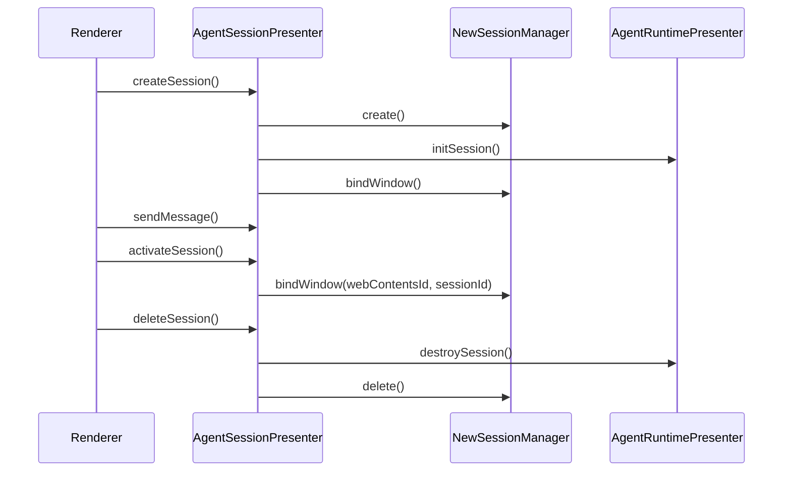

# Session Management Architecture

After the retirement, session management is explicitly split into two layers:

- Active chat layer: `agentSessionPresenter` + `NewSessionManager`
- Compatibility data layer: `SessionPresenter`

## Current Responsibility Boundary

| Component | Location | Current responsibility |
| --- | --- | --- |
| `AgentSessionPresenter` | `src/main/presenter/agentSessionPresenter/index.ts` | The single renderer-facing session entry point |
| `NewSessionManager` | `src/main/presenter/agentSessionPresenter/sessionManager.ts` | `new_sessions` records, window binding, session CRUD |
| `ArgosSessionStore` | `src/main/presenter/agentRuntimePresenter/sessionStore.ts` | Active runtime state |
| `ArgosMessageStore` | `src/main/presenter/agentRuntimePresenter/messageStore.ts` | New message persistence, paginated reads, structured content reconstruction |
| `SessionPresenter` | `src/main/presenter/sessionPresenter/index.ts` | Legacy conversation/thread/export compatibility layer |
| `sessionPresenter/messageFormatter.ts` | `src/main/presenter/sessionPresenter/messageFormatter.ts` | User-message context formatting, reused by the exporter |

## Session Lifecycle in the Main Path

## What `SessionPresenter` Does Now

`SessionPresenter` is still retained, but inside main it only handles:

- Access to old `conversations/messages` data
- Legacy thread list broadcasts
- Legacy conversation export
- Compatibility cleanup hooks when a tab is closed
- Reuse of legacy message formatting helpers

It no longer handles:

- The renderer's main chat entry point
- Legacy runtime session memory
- `AgentPresenter` stream/loop coordination

## Key Changes After Cleanup

- `SessionPresenter.toSession()` no longer depends on the legacy runtime in-memory state.
- The old `cleanupLegacyConversationRuntime()` has been collapsed into a neutral internal cleanup method.
- The renderer IPC no longer exposes `sessionPresenter`.

## When You Still Need to Look at `SessionPresenter`

You only need to step into `src/main/presenter/sessionPresenter/` for these scenarios:

- Maintaining legacy conversation export
- Adjusting compatibility reads after legacy import
- Troubleshooting thread list broadcasts and window cleanup
- Maintaining the user-message normalization used by the exporter

For current chat session creation, sending messages, canceling generation, or tool interaction, start reading from `agentSessionPresenter` and `agentRuntimePresenter` directly.

## Restore and History Pagination

The new chat restore path no longer assumes "open a session = read all messages at once":

- `sessions.restore` only returns the most recent page of messages, defaulting to `100`
- `sessions.listMessagesPage` continues paging into older messages
- The renderer `messageStore` loads only the first page on initial render, and `ChatPage` pulls older history as the user nears the top

This keeps initial render time stable for large sessions and decouples "very long history" from "first screen usable".

## Current Session Capabilities

- The session list supports lightweight pagination, filtering by agent/project/subagent, fixed alphabetical ordering, and pinned-first ordering.
- `generationSettings` are stored in the session runtime and can be read and updated by the renderer via `sessions.getGenerationSettings` / `sessions.updateGenerationSettings`.
- `sessions.compact` provides manual context compaction; the default auto-compaction threshold comes from the agent/settings configuration.
- `sessions.listMessageTraces` provides message trace queries, so traces are no longer mixed into the message body.
- `sessions.searchHistory` prefers FTS5 through the structured search documents table, falling back to `LIKE` on failure.
- Subagent sessions share the table structure with regular sessions but are distinguished in lifecycle and presentation via `sessionKind`, `parentSessionId`, and `subagentMeta`.
