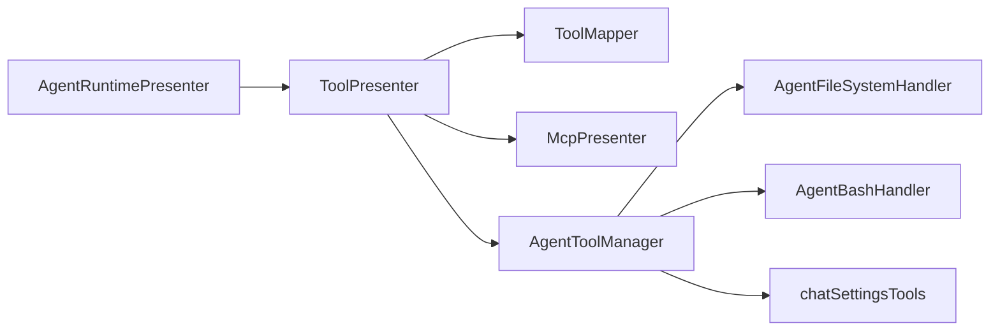
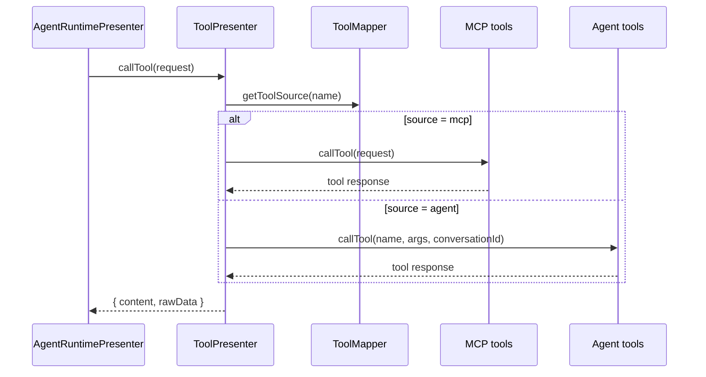

# Tool System Architecture In Detail

This document reflects the layering of the tool system after retirement. Agent tools have been migrated
from the legacy `agentPresenter/acp/` directory to the currently active directory.

## Current Components

| Component | Location | Responsibility |
| --- | --- | --- |
| `ToolPresenter` | `src/main/presenter/toolPresenter/index.ts` | Aggregates tool definitions, builds mappings, and routes calls |
| `ToolMapper` | `src/main/presenter/toolPresenter/toolMapper.ts` | `toolName -> source` mapping |
| `AgentToolManager` | `src/main/presenter/toolPresenter/agentTools/agentToolManager.ts` | Assembly and execution of local agent tools |
| `AgentFileSystemHandler` | `src/main/presenter/toolPresenter/agentTools/agentFileSystemHandler.ts` | File-system tools |
| `AgentBashHandler` | `src/main/presenter/toolPresenter/agentTools/agentBashHandler.ts` | Command execution and background sessions |
| `chatSettingsTools` | `src/main/presenter/toolPresenter/agentTools/chatSettingsTools.ts` | chat/session settings tools |
| `McpPresenter` | `src/main/presenter/mcpPresenter/` | External MCP servers and tools |
| `ACP helpers` | `src/main/presenter/llmProviderPresenter/acp/` | ACP provider runtime, workdir, config, and MCP mapping |

## Routing Relationships



## Getting Tool Definitions

`ToolPresenter.getAllToolDefinitions()` does three things in order:

1. Pulls MCP tools from `mcpPresenter`.
2. Pulls local agent tools from `AgentToolManager`.
3. Records the source via `ToolMapper`, preferring MCP tools on name collisions.

This means `agentRuntimePresenter` does not need to know the real source of a tool. It only needs to hold a
uniform `MCPToolDefinition[]`.

## Calling Tools



## Permissions and the Runtime Port

Local agent tools no longer depend on the legacy presenter runtime directly. Instead, they are injected via an explicit port:

- `src/main/presenter/toolPresenter/runtimePorts.ts`
- `AgentToolRuntimePort`

The port is responsible for providing:

- conversation workdir resolution
- approved-path queries
- settings approval consumption
- session context bridging for `agentSessionPresenter`

Permission capability split:

- File access: `filePermissionService`
- Settings changes: `settingsPermissionService`
- Shell/command: `CommandPermissionService`

## ACP-related Helpers

The ACP provider is still an active capability, but its helpers have been moved to the provider layer:

```text
src/main/presenter/llmProviderPresenter/acp/
├── acpProcessManager.ts
├── acpSessionManager.ts
├── acpSessionPersistence.ts
├── acpConfigState.ts
├── acpCapabilities.ts
├── acpContentMapper.ts
├── acpFsHandler.ts
├── acpMessageFormatter.ts
├── acpTerminalManager.ts
├── mcpConfigConverter.ts
├── mcpTransportFilter.ts
└── types.ts
```

These modules now only serve `LLMProviderPresenter` / `AcpProvider` and are no longer attached to the legacy
`AgentPresenter`.

## Debugging Suggestions

When troubleshooting tool issues, the recommended order is:

1. `src/main/presenter/toolPresenter/index.ts`
2. `src/main/presenter/toolPresenter/toolMapper.ts`
3. `src/main/presenter/toolPresenter/agentTools/agentToolManager.ts`
4. The specific handler
5. `src/main/presenter/mcpPresenter/toolManager.ts`

If you see the legacy path `src/main/presenter/agentPresenter/acp/*`, that belongs to an archived historical implementation.
